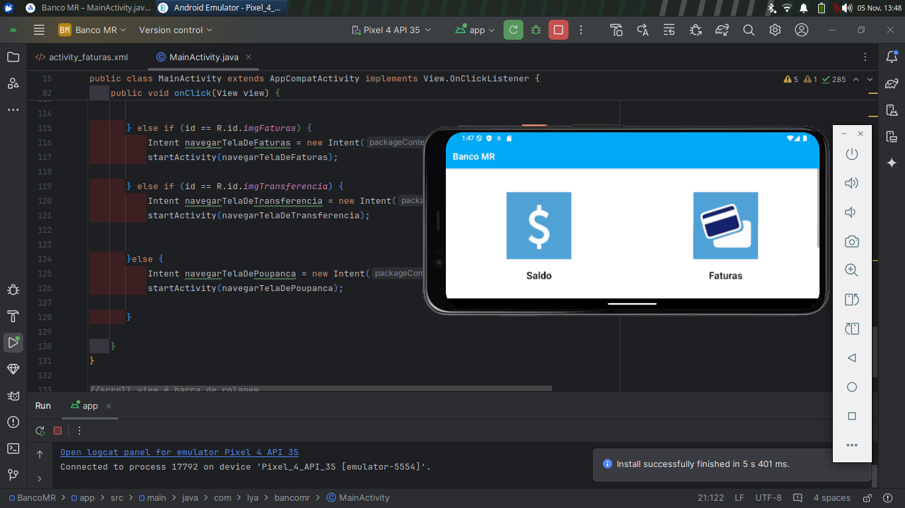
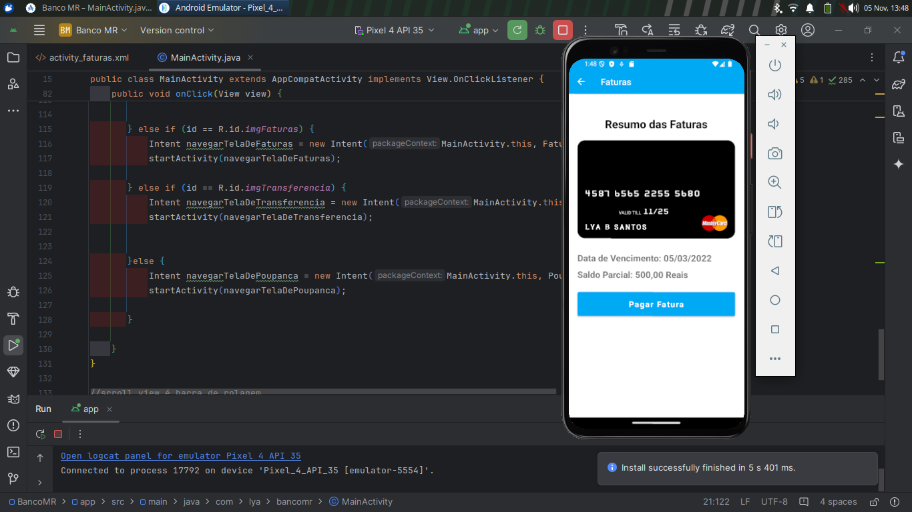

Banco MR - Aplicativo Android

O Banco MR é um aplicativo Android que simula funcionalidades bancárias, permitindo navegação entre várias telas para acessar informações sobre saldo, faturas, transferência e poupança. Este projeto demonstra a navegação eficiente entre diferentes atividades (telas) e implementa uma interface intuitiva para o usuário.

Principais Funcionalidades:

Navegação Entre Telas: O aplicativo utiliza Intent para navegar entre várias telas, incluindo Saldo, Faturas, Transferência e Poupança. Cada botão na tela principal direciona o usuário para uma seção específica do aplicativo.

Interface de Clique Unificada: Implementação da interface OnClickListener para gerenciar os eventos de clique de vários botões em uma única função onClick(View view), reduzindo a repetição de código. Isso torna o código mais organizado e escalável, especialmente útil ao lidar com múltiplos botões clicáveis na mesma tela.

Organização e Redução de Código: A implementação da interface OnClickListener elimina a necessidade de criar setOnClickListener separadamente para cada botão, consolidando o gerenciamento de cliques em um único método. Essa abordagem simplifica o código e facilita a manutenção.

Tecnologias e Conceitos Utilizados:

View Binding: Facilita o acesso aos elementos de layout sem a necessidade de findViewById, melhorando a legibilidade do código.

Intents para Navegação: Cada botão utiliza Intent para direcionar o usuário a uma tela diferente, simulando uma experiência bancária simplificada.

Interface OnClickListener: Implementação para lidar com múltiplos cliques em uma única função, organizando a lógica de navegação de maneira eficiente.

Scroll View: Permite rolagem na interface, facilitando o acesso a todos os elementos em telas menores.

